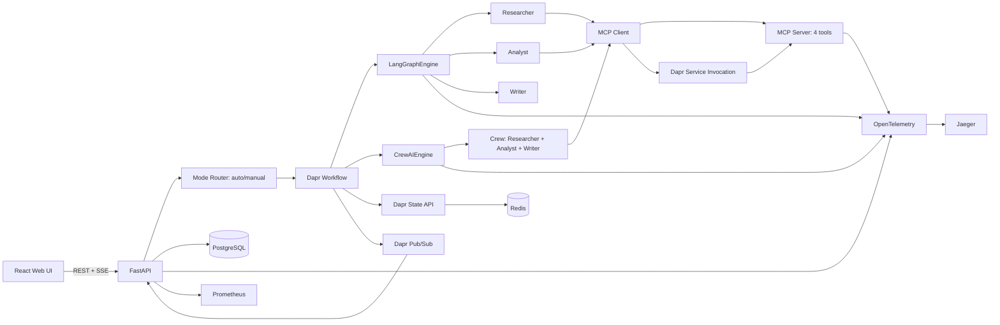

# AI Native 多智能体协作平台：开发执行计划

> 依据：`要求.md`  
> 周期：2 周，共 10 个工作日  
> 原则：先完成可演示闭环，再补工程亮点；同时实现 LangGraph 与 CrewAI 两种编排模式，但共用基础设施，不做两套重复平台。

## 1. 项目目标

实现一个可本地运行的多智能体协作平台。用户提交研究类任务后，可以手动指定或让系统自动选择 LangGraph/CrewAI 编排模式，完成“资料收集 → 内容分析 → 报告生成”，并能够在 Web 页面中查看执行状态、步骤结果、工具调用和历史任务。

最终必须演示以下能力：

1. 单 Agent 能调用本地或远程大模型完成结构化问答。
2. LangGraph 模式能通过状态图、共享状态和 checkpoint 完成多 Agent 协作。
3. CrewAI 模式能通过 Agents、Tasks、Crew 完成相同的多角色场景。
4. `auto` 模式能通过 LLM 结构化分类自动选择编排引擎，也允许用户手动覆盖。
5. Dapr Workflow、State Management、Pub/Sub、Service Invocation 能共同完成持久化、事件通信和服务调用；服务重启后任务可继续或安全重试。
6. Agent 能通过 MCP 动态发现并调用至少 4 个工具。
7. DeepSeek、Ollama、OpenAI、Claude 可通过统一配置切换，业务编排代码不随供应商改变。
8. Redis 同时支持短期会话状态；PostgreSQL 保存任务历史和简单长期偏好。
9. Jaeger 能查看调用链，Prometheus 能查看任务、Token 和工具指标。
10. Web UI 能提交任务、选择编排模式、查看执行过程和历史任务、暂停/恢复任务，并在线调整 Agent 角色与模型参数。
11. Docker Compose 可一键启动；两个 worker 副本下任务仍可正确执行。
12. 项目具有完整 README、API 文档、测试记录、演示脚本和课程报告。

### 1.1 要求解释原则

- 第 70～74 行明确写“同时支持”并要求自动选择，因此最终交付必须包含 LangGraph 和 CrewAI；第 108、116 行的“或/二选一”解释为开发顺序和主次建议，不能用来删除另一模式。
- “长期记忆”属于功能要求；只有向量数据库被标记为可选。因此 P0 用 PostgreSQL 保存结构化偏好，P1 才增加向量语义检索。
- “水平扩展”要求平台架构支持多 worker；本作业用 Docker Compose 双 worker 验证，不扩展为 Kubernetes 交付。
- Dapr Workflow 提供耐久重放和 Activity 重试，但外部副作用仍必须由本项目实现幂等，不能把所有业务调用笼统描述为天然 Exactly-Once。
- “行为追踪”记录 Agent 的计划摘要、动作、工具调用和观察结果，不保存或展示模型隐藏思维链。

## 2. 范围控制

### 2.1 必须完成（P0）

- 两种真实可运行的编排模式：
  - LangGraph：固定主图、共享 `TaskState`、条件边和 checkpoint。
  - CrewAI：对应的 Agents、Tasks、Crew 顺序协作。
- 一个共享 `OrchestrationEngine` 接口，支持 `langgraph`、`crewai`、`auto` 三个取值。
- `auto` 使用 LLM 输出结构化路由结果，并提供确定性 fallback；前端允许手动选择覆盖。
- Planner 可从三个注册角色中选择本次任务需要的角色并分配子任务；`writer` 固定保留，其他角色可通过条件边/动态 Task 跳过。
- 三个 Agent 角色：
  - `researcher`：收集资料并记录来源。
  - `analyst`：提炼事实、比较信息并生成分析提纲。
  - `writer`：根据资料和提纲生成 Markdown 报告。
- 一个任务场景：输入主题，输出带来源的结构化研究报告。
- Dapr Workflow、State Management、Pub/Sub、Service Invocation 和 Dapr Agents 生命周期集成。
- Dapr Agents 使用 `DaprChatClient`/等价稳定客户端、Dapr State memory，并完成一个 `DurableAgent` 单 Agent 恢复 smoke test；主业务编排仍由 LangGraph/CrewAI 完成。
- Redis 保存 Dapr Workflow、任务状态和短期会话状态。
- PostgreSQL 保存用户会话、任务元数据、步骤结果、审计记录和结构化用户偏好。
- 一个 MCP Server，提供 4 个真实可调用的工具。
- DeepSeek API 用于前期开发；Ollama、OpenAI、Claude 提供可切换配置和适配器。
- FastAPI REST API 与 SSE 任务进度推送。
- 简洁 Web 控制台，包括模式选择、历史、暂停/恢复、角色配置和模型参数配置。
- OpenTelemetry、Jaeger、Prometheus。
- 10 并发测试、故障恢复测试，以及 LangGraph/CrewAI Token 与耗时对比。
- Docker Compose、本地开发脚本、自动化测试和项目文档。

### 2.2 有余力再做（P1）

- 任务取消、失败步骤重试和报告下载。
- 通过向量数据库进行长期记忆语义检索。
- 允许运行时创建全新的自定义角色，而不局限于三个已注册角色。
- Prometheus 告警规则和 Grafana 仪表板。
- Kubernetes 部署清单与自动水平扩缩容。

### 2.3 本次明确不做

- AutoGen、AG2、AGNO 等第三套 Agent 框架。
- 可视化拖拽工作流设计器和无限制生成任意 Agent。
- 将 LangGraph 与 CrewAI 混合在同一个任务实例内；每个任务只选择一个引擎。
- 完整 RAG 知识库；长期记忆 P0 只保存结构化偏好，向量检索属于 P1。
- 用户注册、复杂权限、计费和多租户。
- React 状态管理框架、组件库和复杂动画。
- 在宿主机直接执行 Agent 生成的 Python 或 Shell 命令；代码只能进入受限沙箱。

双模式共享 LLM、MCP、Dapr、存储、API、事件模型和 Web UI，避免重复实现基础设施。差异只保留在 `LangGraphEngine` 与 `CrewAIEngine` 两个适配器内部。

## 3. 规定技术栈

| 层次 | 技术选择 | 约束 |
| --- | --- | --- |
| 后端语言 | Python 3.12 | 使用 `uv` 管理依赖和虚拟环境 |
| REST API | FastAPI、Pydantic v2、Uvicorn | API 前缀统一为 `/api` |
| Agent 编排 | LangGraph >=1.1,<2；CrewAI >=1.14,<2 | 两个引擎实现同一协议，具体版本写入锁文件 |
| 耐久执行 | Dapr Runtime 1.17+、Dapr Workflow、Dapr Agents 1.x | 具体补丁版本写入锁文件 |
| 前期开发模型 | DeepSeek API | 使用 OpenAI-compatible 接口；模型名只放环境变量 |
| 本地演示模型 | Ollama + `qwen3:8b` | 低配置机器可改为 `qwen3:4b` |
| 其他模型 | OpenAI、Claude | 通过 Dapr Conversation 组件/统一适配器切换 |
| MCP | 官方 MCP Python SDK v1 | 当前先约束 `mcp>=1.27,<2`，升级 v2 前必须跑回归测试 |
| 前端 | React 19、TypeScript、Vite、Tailwind CSS 4 | 使用原生 `fetch` 和 `EventSource`，不引入 Redux |
| 工作流状态 | Redis 7 | 同时作为 Dapr actor/workflow state store |
| 业务数据 | PostgreSQL 16、SQLAlchemy 2、Alembic | 任务、步骤、消息、审计日志 |
| 可观测性 | OpenTelemetry、Jaeger、Prometheus | 日志采用 JSON 格式 |
| 测试 | Pytest、pytest-asyncio、HTTPX、Vitest、Locust | 端到端演示另有检查清单 |
| 代码质量 | Ruff、mypy、ESLint、Prettier、TypeScript strict | 合并前必须通过检查 |
| 部署 | Docker、Docker Compose、Dapr CLI | 不要求 Kubernetes |

说明：

- 业务层只依赖 `LLMClient` 和能力描述，不读取供应商名称。DeepSeek、Ollama、OpenAI、Claude 的 endpoint、key、model 均来自环境变量或 Dapr component。
- 普通对话、流式输出、工具调用和结构化输出使用各供应商共同能力；推理模式等私有参数只能放在 provider adapter 内。
- Dapr Conversation API 当前已有 DeepSeek、Ollama、OpenAI、Anthropic 组件；真实验收至少运行 DeepSeek 与 Ollama，另外两个使用配置校验和 mock contract test，避免课程项目产生不必要费用。
- Dapr 负责工作流生命周期、状态、发布订阅和服务调用；LangGraph/CrewAI 负责各自的 Agent 编排，职责不能混在一起。
- Dapr Workflow Activity 可能因失败而重试。任何写数据库、调用工具的 Activity 都必须使用 `task_id + step_name` 作为幂等键，不能宣称普通外部副作用天然具备 Exactly-Once。
- 官方 MCP Python SDK v2 在本计划编写时仍处于预发布阶段，因此先使用稳定 v1 并锁定上界。

## 4. 简化后的系统设计



### 4.1 双编排模式

两个引擎实现统一协议：

```python
class OrchestrationEngine(Protocol):
    async def run(self, request: TaskRequest) -> TaskResult: ...
    async def resume(self, task_id: str) -> TaskResult: ...
```

任务请求的 `engine` 取值：

- `langgraph`：用户明确选择 LangGraph。
- `crewai`：用户明确选择 CrewAI。
- `auto`：调用 LLM 生成 `{engine, reason, subtasks}` 结构化结果；校验失败时默认 LangGraph。

自动选择的简单规则应体现在路由提示词中：

- 长流程、需要 checkpoint、条件分支或精细状态控制：优先 LangGraph。
- 明确要求多个专业角色分工、产出依次交接：优先 CrewAI。

平台级“同时支持”表示两个模式均真实可运行，而不是同时在一个任务中嵌套执行。这样既符合要求，也避免双框架状态互相污染。

### 4.2 共享任务模型与 LangGraph 状态

统一状态对象 `TaskState` 至少包含：

```text
task_id
session_id
engine_requested
engine_selected
engine_selection_reason
user_query
plan
assigned_roles[]
sources[]
research_notes[]
analysis
report
current_step
tool_calls[]
errors[]
```

LangGraph 固定主图：

```text
START
  -> plan
  -> select_roles
  -> researcher
  -> analyst
  -> writer
  -> persist_result
  -> END
```

CrewAI 使用同一批角色配置，建立对应的 `Agent`、`Task` 和顺序执行的 `Crew`。三个 Task 的输出 schema 与 LangGraph 节点保持一致，确保 API、数据库和 UI 无需区分内部框架。

`plan` 负责生成结构化子任务与角色分配，可在已注册的三个角色中选择；P0 不动态生成新的任意角色。节点/Task 输出必须使用 Pydantic 模型校验；解析失败只重试一次，随后进入失败状态。

### 4.3 Dapr 与双引擎的边界

- FastAPI 创建 Dapr Workflow 实例并立即返回 `task_id`。
- Dapr Workflow 管理 `queued/running/paused/succeeded/failed/cancelled` 生命周期。
- LangGraph 执行具体 Agent 图，并使用稳定的 `thread_id=task_id` 保存 checkpoint。
- 实现 `DaprCheckpointSaver`（或等价 adapter），通过 Dapr State API 保存/读取 LangGraph checkpoint，而不是另建第三套 checkpoint 数据库。
- CrewAI 将每个关键 Task 包装为 Dapr Workflow Activity，使角色步骤可分别持久化和重试，避免整个 Crew 从头重复。
- Dapr Agents 提供统一 LLM/记忆接入和 Agent 生命周期能力；不使用已弃用的普通 `Agent` 类，新代码优先采用当前稳定 API。
- Dapr State API 保存可供 API 快速查询的当前任务状态。
- PostgreSQL 保存适合列表查询和报告展示的业务记录。
- 服务重启后，Dapr 重试未完成 Activity；LangGraph 使用同一 `thread_id` 从最近 checkpoint 继续。
- 每个 Agent/Task 完成后通过 Dapr Pub/Sub 发布 `agent.task.events` 事件，API 消费事件并写入审计记录，再通过 SSE 推送给前端。
- MCP Server 作为独立 Dapr app，调用通过 Dapr Service Invocation 完成，并设置超时、重试和访问范围。
- LLM、HTTP、数据库和 MCP 调用必须放在 Activity 或 Agent 节点中，不能放进要求确定性重放的 Workflow 编排代码中。

### 4.4 记忆设计

- **会话记忆**：按 `user_id + session_id` 保存最近若干轮消息到 Redis/Dapr State，传给两种编排模式使用。
- **长期偏好**：将用户明确表达的语言、报告格式、关注领域等结构化偏好保存到 PostgreSQL；创建任务时按用户读取。
- **工作流记忆**：Dapr Workflow 保存生命周期；LangGraph checkpoint 保存图状态；CrewAI 每个 Task 结果作为 Activity 输出持久化。
- **向量语义记忆**：属于 P1，不是完成长期偏好记忆的前置条件。

### 4.5 MCP 工具

只建立一个 MCP Server，提供以下 4 个工具：

| 工具 | 功能 | 安全限制 |
| --- | --- | --- |
| `calculator` | 四则运算和常见数学函数 | AST 白名单，禁止直接 `eval` 任意代码 |
| `web_search` | 通过 Wikipedia/可配置搜索 API 返回标题、摘要和 URL | 5 秒超时、最多 5 条、域名与响应大小限制 |
| `code_runner` | 按 `language=python|shell` 执行短小数据处理代码 | 独立无网络容器、命令白名单、非 root、只读文件系统、CPU/内存/时长限制 |
| `readonly_sql` | 查询演示数据库 | 只允许单条 `SELECT`，只读账号、行数和执行时间限制 |

MCP Server 采用 Streamable HTTP，供两个编排引擎共用。工具 schema 在运行时动态发现，并转换为 LangGraph/CrewAI 各自需要的工具格式。MCP Server 注册为独立 Dapr app，后端通过 Dapr Service Invocation 地址访问；需要原样转发 MCP session、content-type 和 tracing headers。

### 4.6 最小 Web UI

只设计三个页面：

1. **新建任务**：输入任务，选择 `自动/LangGraph/CrewAI`、模型、temperature，提交后跳转详情页。
2. **任务详情**：显示请求/实际编排模式、自动选择原因、状态、当前步骤、Agent 时间线、工具调用摘要、Token 和最终报告。
3. **历史与设置**：历史任务列表；在线配置模型参数，以及三个角色的 role、goal、backstory/instructions。

页面使用简单卡片、状态徽标和纵向时间线。任务更新使用 SSE；不为这个作业引入 WebSocket。

### 4.7 最小 API

| 方法 | 路径 | 用途 |
| --- | --- | --- |
| `POST` | `/api/tasks` | 创建任务，接收 `engine=auto|langgraph|crewai` |
| `GET` | `/api/tasks` | 查询历史任务 |
| `GET` | `/api/tasks/{task_id}` | 查询任务详情 |
| `GET` | `/api/tasks/{task_id}/events` | SSE 进度 |
| `POST` | `/api/tasks/{task_id}/pause` | 暂停 |
| `POST` | `/api/tasks/{task_id}/resume` | 恢复 |
| `POST` | `/api/tasks/{task_id}/cancel` | 取消，P1 |
| `GET/PUT` | `/api/settings` | 获取或修改模型与 Agent 配置 |
| `GET` | `/api/providers` | 查询已配置模型供应商及共同能力 |
| `GET` | `/api/tools` | 查询 MCP 动态发现的工具 |
| `GET` | `/health` | 存活检查 |
| `GET` | `/ready` | Redis、PostgreSQL、Dapr、MCP 就绪检查 |
| `GET` | `/metrics` | Prometheus 指标 |

## 5. 建议项目目录

```text
AI-Native/
├─ apps/
│  ├─ api/
│  │  ├─ src/
│  │  │  ├─ api/
│  │  │  ├─ orchestration/
│  │  │  │  ├─ langgraph_engine/
│  │  │  │  ├─ crewai_engine/
│  │  │  │  └─ router/
│  │  │  ├─ agents/
│  │  │  ├─ llm/
│  │  │  ├─ workflows/
│  │  │  ├─ events/
│  │  │  ├─ mcp_client/
│  │  │  ├─ persistence/
│  │  │  └─ observability/
│  │  └─ tests/
│  ├─ mcp-server/
│  │  ├─ src/tools/
│  │  └─ tests/
│  └─ web/
│     ├─ src/
│     └─ tests/
├─ dapr/
│  ├─ components/
│  └─ config/
├─ infra/
│  ├─ compose.yaml
│  ├─ prometheus.yml
│  └─ docker/
├─ tests/
│  ├─ integration/
│  ├─ e2e/
│  └─ load/
├─ docs/
├─ .env.example
├─ AGENTS.md
├─ README.md
├─ 开发执行计划.md
└─ 要求.md
```

## 6. 两周开发路线图

### 阶段一：环境与单 Agent（第 1～2 天）

#### 第 1 天：项目骨架与基础设施

完成内容：

- 创建后端、MCP Server、前端和基础设施目录。
- 初始化 Python、TypeScript 项目和锁文件。
- 编写 `.env.example`，统一端口和服务名。
- 建立 Redis、PostgreSQL、Jaeger、Prometheus 的 Compose 服务。
- 初始化 Dapr 配置、Redis state store、Redis Pub/Sub 和 Conversation component 模板。
- 建立 `OrchestrationEngine`、`LLMClient` 和共享领域模型的接口骨架。
- 建立 `/health`、`/ready` 接口。
- 配置 Ruff、mypy、ESLint、Prettier 和基础 CI 命令。

当天验收：

- `docker compose up -d redis postgres jaeger prometheus` 成功。
- 后端能启动，`/health` 返回 200。
- 所有密钥只从环境变量读取。

#### 第 2 天：单 Agent 与多模型适配

完成内容：

- 实现统一 `LLMClient`。
- 首先对接 DeepSeek 外部 API，完成开发期真实调用。
- 增加 Ollama、OpenAI、Claude 的配置与 adapter；Ollama 使用 OpenAI-compatible endpoint。
- 为四种供应商建立共同能力 contract test，供应商私有参数不得进入 Agent 业务代码。
- 建立 `writer` 单 Agent 原型。
- 使用 Pydantic 校验结构化输出。
- 实现一次超时和一次有限重试。
- 为模型不可用、输出解析失败编写测试。

当天验收：

- 输入一个主题可以返回 Markdown 摘要。
- 只修改环境变量即可在 DeepSeek 与 Ollama 之间切换，不修改 Agent 代码。
- 日志包含 `task_id`、模型名、耗时和成功状态。
- 单 Agent 测试在不连接真实模型时可通过 mock 执行。

阶段输出：单 Agent 基本对话能力。

### 阶段二：Dapr 持久化（第 3～4 天）

#### 第 3 天：状态与会话持久化

完成内容：

- 定义任务状态机和数据库表。
- 通过 Dapr State API 读写当前任务状态。
- 使用 PostgreSQL 保存任务、步骤、消息和工具调用记录。
- Redis 保存短期对话上下文，PostgreSQL 保存结构化用户偏好。
- 为每个任务生成稳定的 `task_id`、`workflow_id`、`thread_id`。
- 实现并接入基于 Dapr State API 的 LangGraph checkpointer。
- 配置 `agent.task.events` Pub/Sub topic，并完成发布/消费冒烟测试。
- 实现任务详情和历史列表 API。

当天验收：

- 服务重启后仍能查询历史会话和任务状态。
- 同一 session 能继承有限上下文，新 session 能读取用户结构化偏好。
- Pub/Sub 事件可被 API 消费并写入审计记录。
- 相同幂等键不会产生重复步骤记录。

#### 第 4 天：Dapr Workflow 与恢复

完成内容：

- 创建任务 Workflow 和 Activity。
- 接入 Dapr Agents 的统一 LLM/记忆能力，并建立双引擎共用的 Activity 约束。
- 完成一个最小 `DurableAgent` smoke test，验证 Dapr Agents 1.x 的生命周期和重启恢复。
- 实现启动、查询、暂停和恢复。
- 配置 Activity 超时、重试和失败状态。
- 准备一个带人为延迟的测试 Activity。
- 在运行中停止 API/worker，再启动并验证恢复。

当天验收：

- 重启前后的 `task_id` 不变。
- 已成功的步骤不重复产生业务记录。
- 演示一次任务暂停和恢复。
- 两个 worker 实例可以领取工作，API 本身保持无状态。

阶段输出：Dapr Workflow、State Management、Pub/Sub 与基础生命周期集成完成。

### 阶段三：多 Agent 工作流（第 5～6 天）

#### 第 5 天：LangGraph 多节点图 + Web 基础

完成内容：

- 定义 `TaskState` 和 reducer。
- 实现 `plan`、`researcher`、`analyst`、`writer` 节点。
- 实现 LangGraph checkpoint 和从 checkpoint 恢复。
- 为每个角色编写短、明确、可版本控制的系统提示词。
- 节点之间只传结构化数据，不拼接无限增长的完整消息历史。
- 为每个节点建立单元测试。
- **（Web 提前）** 实现 `GET/PUT /api/settings` 与 `GET /api/tasks/{task_id}/events`（SSE）。
- **（Web 提前）** 完成前端路由、API 客户端、新建任务页、任务详情页（SSE + 轮询降级）。

当天验收：

- 使用 mock LLM 能完整走通图。
- LangGraph 模式能够通过 Dapr Workflow 启动并产生节点事件。
- 节点失败时任务进入 `failed`，错误可在 API 查询。
- **浏览器提交 `engine=langgraph` 任务，能实时看到步骤时间线（SSE 或轮询降级）。**

#### 第 6 天：CrewAI 模式与自动路由 + Web 完整控制台

完成内容：

- 使用共享角色配置创建 CrewAI Agents、Tasks 和 Crew。
- 将三个 CrewAI Task 分别放入可持久化的 Dapr Workflow Activity。
- 实现 `engine=langgraph|crewai|auto` 路由；`auto` 使用 LLM 结构化分类并提供 fallback。
- 统一两个引擎的步骤事件、Pydantic 输出、数据库记录和错误模型。
- 用两个引擎分别完成“资料收集 → 分析 → 报告”场景。
- 验证 LangGraph checkpoint 与 CrewAI Activity 重试不会重复已完成的外部副作用。
- **（Web 提前）** 完成历史列表、设置页（三角色 role/goal/backstory/instructions + temperature/max_tokens）。
- **（Web 提前）** 任务详情页支持暂停/恢复、引擎选择原因、Markdown 报告、loading/empty/error 态。
- **（Web 提前）** `compose.yaml` 增加 `web` 服务。

当天验收：

- LangGraph 与 CrewAI 均能通过真实模型生成结构化报告。
- 自动模式能返回选择结果和简短原因，也可被手动选择覆盖。
- 可看到两个模式下三个 Agent 的中间输出和完整状态变化。
- **不通过 Swagger，浏览器可分别提交 LangGraph、CrewAI 和 auto 任务并查看完整执行过程。**
- **刷新任务详情页后状态不会丢失。**

阶段输出：LangGraph/CrewAI 双模式与自动选择能力；Web 控制台可作为日常验收主入口。

### 阶段四：MCP 与可观测性（第 7～8 天）

#### 第 7 天：4 个 MCP 工具

完成内容：

- 使用 FastMCP 建立一个 MCP Server。
- 实现工具发现、参数 schema 和标准错误响应。
- 完成 `calculator`、`web_search`、`code_runner`、`readonly_sql`。
- `code_runner` 在隔离容器内支持受限 Python/Shell，不直接访问宿主机。
- MCP Client 动态发现工具，并转换为 LangGraph/CrewAI 各自可调用的格式。
- MCP transport 经 Dapr Service Invocation 调用独立 MCP app。
- 为超时、非法 SQL、非法代码、越权访问和超大返回值建立测试。

当天验收：

- 后端可以列出 4 个工具。
- 两个编排模式都能自主选择并调用至少 2 个工具。
- 4 个工具均能通过独立集成测试。

#### 第 8 天：追踪、指标与审计

完成内容：

- FastAPI、LangGraph 节点、CrewAI Task、LLM 和 MCP 调用创建 span。
- trace context 在 API、Workflow、两种引擎、Pub/Sub 和 MCP 间传递。
- Prometheus 按低基数 `engine`、`provider` 标签暴露任务完成率、耗时、Token、工具调用成功率。
- 记录模型返回的 token/usage；本地模型没有可靠 usage 时标记为 `unknown`，不伪造数值。
- 行为日志记录计划摘要、工具选择、动作、观察结果与最终决策，不保存或展示模型隐藏思维链。
- 结构化日志隐藏提示词中的敏感信息和 API key。

当天验收：

- Jaeger 能看到一次任务的主要调用链。
- Prometheus 能按 LangGraph/CrewAI 查询任务、Token 和工具指标。
- 通过 `task_id` 或 `trace_id` 可关联日志。

阶段输出：MCP 工具生态与基础可观测性。

### 阶段五：集成测试与交付（第 9～10 天）

> Web 控制台已前移至第 5～6 天；本阶段聚焦可观测性补强、端到端集成与课程交付。

#### 第 9 天：可观测性补强 + Web 增量

完成内容：

- 完成 MCP 工具列表在 Web 详情页的展示（对接 `GET /api/tools`）。
- 在任务详情页展示 Token 用量与工具调用指标（对接 Prometheus 或 API 聚合字段）。
- SSE 断线重连与轮询降级的压测与边界修复。
- 补充 Web 端到端测试（创建 → SSE → 刷新不丢状态 → 暂停/恢复）。

当天验收：

- Jaeger 与 Prometheus 指标可在 Web 演示流程中关联查看。
- MCP 工具调用可在任务详情页看到摘要。
- SSE 断线后有限重连，失败后自动降级轮询。

#### 第 10 天：集成、部署与报告

完成内容：

- 完整 Compose 编排 API、worker、MCP、Web、Dapr sidecar、Redis、PostgreSQL、Jaeger、Prometheus（Web 服务在第 6 天已接入）。
- 执行单元、集成和端到端检查。
- 执行一次故障恢复演示和 10 并发轻量测试。
- 使用 `docker compose up --scale worker=2` 验证水平扩展与幂等性。
- 对同一固定输入分别运行 LangGraph/CrewAI，记录 Token、耗时和成功率，不据单次结果做泛化结论。
- 编写 README、API 说明、架构图、演示脚本和课程报告。
- 记录已知限制和未完成功能，不用假数据伪装。

当天验收：

- 新环境按照 README 能启动。
- 演示脚本在 8～10 分钟内稳定完成。
- 所有 P0 验收项有截图、日志或测试输出作为证据。

阶段输出：完整交付物和可重复演示。

## 7. 验收矩阵

| 原要求 | 验收方式 | 通过条件 |
| --- | --- | --- |
| 单 Agent | 提交摘要任务 | 返回合法结构化结果 |
| LangGraph 模式 | 指定 `engine=langgraph` | 图节点、共享状态和 checkpoint 均生效 |
| CrewAI 模式 | 指定 `engine=crewai` | Agents、Tasks、Crew 真实执行并产生步骤结果 |
| 自动编排 | 指定 `engine=auto` | 返回选择模式、原因和子任务，手动模式可覆盖 |
| 动态角色分配 | 提交简单任务与复杂任务 | Planner 能在已注册角色中选择子集并分配子任务 |
| 任务规划与分解 | 查看 `plan` 步骤 | 输出固定 schema 的子任务与角色分配 |
| Workflow 持久化 | 中途停止并重启 worker | 原任务继续，状态不丢失 |
| Dapr Agents 1.x | 运行 DurableAgent smoke test | 单 Agent 状态/记忆可持久化并在重启后继续 |
| LangGraph+Dapr checkpoint | 查询 Dapr State 并恢复 | checkpoint 由 Dapr State 保存且可恢复 |
| 会话记忆 | 同一 session 连续提问 | 第二次任务可读取有限历史上下文 |
| 长期偏好 | 新 session 提交任务 | 能读取用户已保存的结构化偏好 |
| Pub/Sub | 查看 Agent 步骤事件 | 事件被消费、审计并推送至 SSE |
| Service Invocation | 查看 MCP 调用 span | MCP 请求经过 Dapr 服务调用 |
| MCP 工具 | 查看工具列表并运行测试 | 4 个工具可发现、可调用 |
| 沙箱隔离 | 执行网络/文件越权代码 | 请求被拒绝或限制在沙箱内 |
| 多模型 | 切换 DeepSeek/Ollama | 只改配置即可运行；OpenAI/Claude contract test 通过 |
| REST API | 自动化接口测试 | 核心接口成功与错误分支均覆盖 |
| Web UI | 浏览器完整操作 | 可选模式、创建、跟踪、查看历史、暂停/恢复和配置角色 |
| 链路追踪 | Jaeger 查询任务 | 能看到 API、双引擎、Agent、Pub/Sub、LLM/MCP span |
| 指标 | Prometheus 查询 | 能按引擎获取任务、Token、耗时、工具成功率 |
| 水平扩展 | 启动两个 worker | 任务可分配且无重复业务记录 |
| 一键部署 | 全新 Compose 启动 | 所有健康检查通过 |

## 8. 测试计划

### 单元测试

- LangGraph reducer 和条件边。
- CrewAI Agent/Task 构造和结果转换。
- 自动路由结构化输出、fallback 和手动覆盖。
- 三个 Agent 的输入输出 schema。
- 任务状态合法迁移。
- calculator AST 白名单。
- SQL 只读校验。
- 配置和密钥加载。

### 集成测试

- FastAPI + PostgreSQL。
- Dapr State API + Redis。
- Dapr Workflow 启停和查询。
- Dapr Pub/Sub 发布与消费。
- Dapr Service Invocation 到 MCP app。
- MCP 工具发现与调用。
- LangGraph/CrewAI 对同一 MCP 工具的适配。
- DeepSeek、Ollama、OpenAI、Claude provider contract test。
- 相同幂等键的重复 Activity。

### 端到端测试

1. 分别创建 LangGraph 与 CrewAI 任务，再创建一个 auto 任务。
2. SSE 收到由 Pub/Sub 事件生成的各步骤更新。
3. 三个任务成功并生成报告。
4. 页面刷新后仍能查询结果和实际编排模式。
5. 任务运行中停止 worker。
6. 重启后任务恢复或安全重试。
7. 切换 DeepSeek/Ollama 后各完成一次单 Agent smoke test。

### 性能测试

- 10 个并发任务，持续 1 分钟。
- 两个 worker 副本运行 10 个并发会话，记录成功率、P50/P95 API 延迟、任务平均耗时和重复记录数。
- “恢复时间 < 5 秒”作为目标而非硬编码结论，最终报告填写实测结果。
- 对相同输入分别运行两种框架至少 3 次，比较 Token、耗时和成功率，并说明样本量限制。

## 9. 每日工作方式

- 每天开始先确认当天唯一可演示目标。
- 每完成一个纵向功能就运行相关测试，不把集成留到第 10 天。
- 每天结束更新 `docs/progress.md`：已完成、测试证据、阻塞项、次日目标。
- 如果后续实际实现与本计划在功能范围、技术栈、系统架构、接口、数据结构、开发顺序或验收标准上出现出入，必须在同一次改动中同步更新本文件，说明变更内容、原因、影响和新的验收方式；不得让计划长期落后于代码。
- 第 4、5、6、8 天各保留一个可运行版本；**第 5 天起以 Web UI 为主要演示入口**。
- 如果进度落后，按顺序削减 P1、界面装饰、Grafana/告警；不得削减双编排模式、自动选择、恢复演示、三 Agent、4 个 MCP 工具、Dapr 四项能力和一键启动。

## 10. 主要风险与降级方案

| 风险 | 处理方式 |
| --- | --- |
| 本机无法流畅运行 8B 模型 | 前期使用 DeepSeek API，离线演示切换 4B 模型；编排代码不随供应商变化 |
| 双框架导致工作量膨胀 | 两者共用角色、schema、LLM、MCP、Dapr、事件、存储和 UI，只保留两个薄编排适配器 |
| Dapr Agents 与编排框架版本不兼容 | 保留接口边界；LangGraph/CrewAI 只负责业务编排，耐久执行可回落到稳定 Dapr Workflow Python SDK |
| MCP v2 发布造成破坏性升级 | 两周内固定 v1 和锁文件，不临时升级主版本 |
| Dapr 代理 MCP transport 存在兼容问题 | 第 1 周先做 session/header 透传 spike；若阻塞，记录问题并将 MCP transport 与独立 Service Invocation 演示分开，但不得宣称已完成未验证的链路 |
| Web 搜索网络不稳定 | 测试使用 mock；演示可使用预置主题和受控本地资料，但必须明确标记离线模式 |
| Python/Shell 沙箱实现超时 | 使用独立、无网络、非 root 的固定 sandbox 服务和命令白名单；绝不退化为宿主机执行 |
| 第 8 天仍未形成完整闭环 | 冻结新功能，先完成 Compose、README 和恢复演示 |
| 后端开发期无法直观看到编排效果 | Web 与 LangGraph 并行开发；SSE 未就绪时详情页轮询 `GET /api/tasks/{id}` 降级 |

## 11. 最终交付清单

- Git/GitHub 源代码仓库和完整依赖锁文件。
- `README.md`：环境要求、配置、启动、测试、演示和常见问题。
- `.env.example`：只含示例值。
- Docker Compose 与 Dapr components。
- Web 控制台。
- LangGraph/CrewAI 两种模式及自动路由的演示记录。
- DeepSeek/Ollama 切换记录，以及 OpenAI/Claude 配置示例。
- OpenAPI 文档。
- Jaeger 和 Prometheus 演示截图。
- 自动化测试输出与负载测试结果。
- 故障恢复演示记录。
- 课程项目报告：需求分析、架构设计、核心模块说明、测试验证结果和已知限制。
- 8～10 分钟演示脚本。
- `AGENTS.md` 项目开发规范。

## 12. 技术选型依据

- [Dapr Agents 1.0 Introduction](https://docs.dapr.io/developing-ai/dapr-agents/dapr-agents-introduction/)
- [Dapr Workflow Overview](https://docs.dapr.io/developing-applications/building-blocks/workflow/workflow-overview/)
- [Dapr State Management](https://docs.dapr.io/developing-applications/building-blocks/state-management/)
- [Dapr CrewAI Workflows](https://docs.dapr.io/developing-ai/agent-integrations/crewai/crewai-workflows/)
- [Dapr Conversation Components](https://docs.dapr.io/reference/components-reference/supported-conversation/)
- [LangGraph Persistence](https://docs.langchain.com/oss/python/langgraph/persistence)
- [MCP 官方 Python SDK](https://github.com/modelcontextprotocol/python-sdk)
- [MCP Server 官方教程](https://modelcontextprotocol.io/docs/develop/build-server)
- [Ollama OpenAI Compatibility](https://docs.ollama.com/api/openai-compatibility)
- [DeepSeek API](https://api-docs.deepseek.com/)
- [Tailwind CSS with Vite](https://tailwindcss.com/docs/installation/using-vite)
